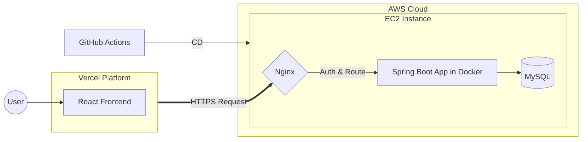

# Inventory Management Frontend  
### React Client for Inventory System

A React-based frontend for the Inventory Management System.

**Core value**:  
This application provides a clean and responsive interface for managing products, suppliers and stock transactions. It integrates with a Spring Boot backend and focuses on usability, data handling, and real-time interaction with REST APIs.

**Live App**:  
https://inventory.menglanyan.dev  

**Live Backend Swagger UI**:  
https://inventory-api.menglanyan.dev/swagger-ui/index.html  

**Backend Repository**:  
https://github.com/menglanyan/inventory-management-system-backend  

---

## Application Overview


- **Client application**: Built with React and deployed on Vercel  
- **API communication**: Axios-based requests to backend REST APIs  
- **Authentication**: JWT stored and attached to protected requests  

---

## Tech Stack

- React  
- Axios
- React Hooks
- React Router

---

## Key Features

- Product, supplier and category management  
- Stock transaction workflows (purchase, sale, return)  
- Pagination and filtering for large datasets  
- Role-based UI (Admin / Manager views)  
- Image upload and preview for products  

---

## Integration with Backend

This frontend interacts with a backend API that provides:

- JWT-based authentication  
- role-based access control  
- transactional inventory handling  
- idempotent transaction processing  

All data is fetched from the backend via REST APIs using Axios.

---

## How to Run

```bash
git clone https://github.com/menglanyan/inventory-management-system-frontend.git
cd inventory-management-system-frontend
npm install
npm start
```

App runs on:  
http://localhost:3000  

---

## Notes

This project is part of a full-stack system.

The backend repository contains the main system design and engineering logic, including:
- transaction handling  
- idempotency  
- deployment pipeline  